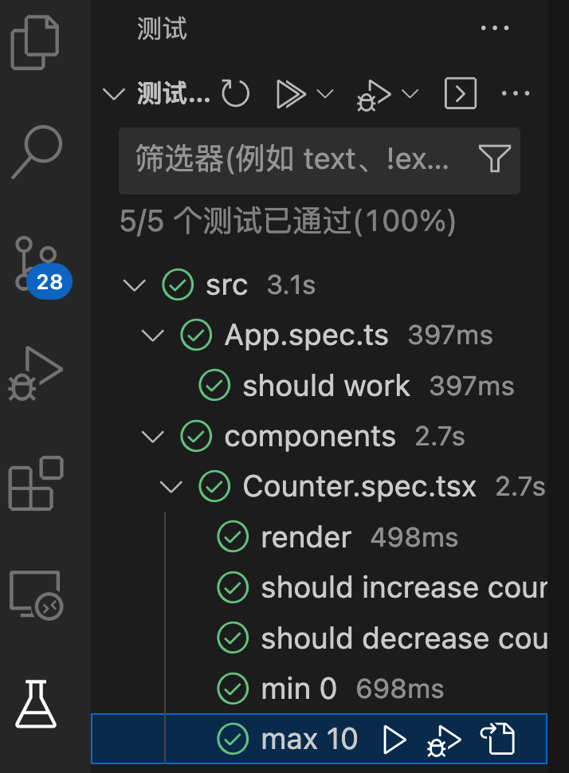
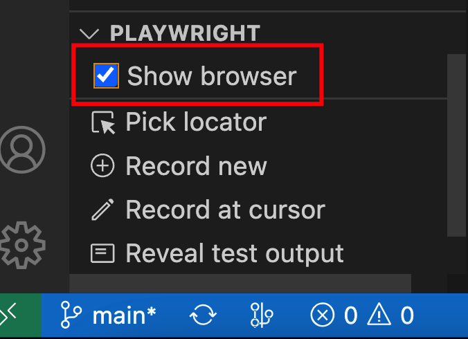

# playwright-component-test

中文文档：https://playwright.bootcss.com/

通过 Playwright Component Test 来测试 Vue3 组件


✅playwright component test 初始化环境配置

✅采用 Tdd 编写 Vue3 组件

✅playwright 快照功能

✅playwright trace viewer 功能

✅playwright codegen 功能


## mind

初始化项目

```shell
pnpm create vite
pnpm i
pnpm create playwright@latest -- --ct
```

> vscode插件： Playwright Test for VS Code



自动打开浏览器



## 坑

- 下载慢
- 错误提示不足

